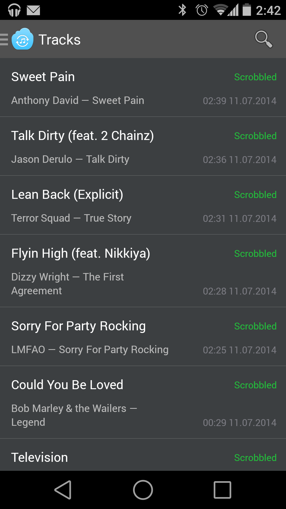
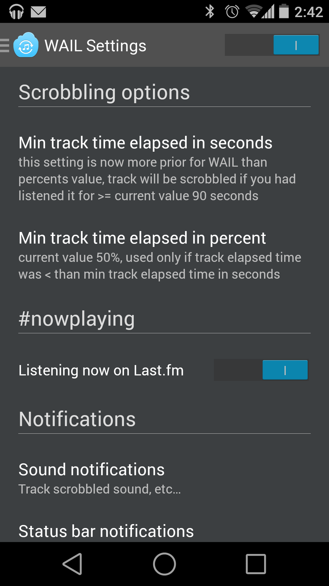
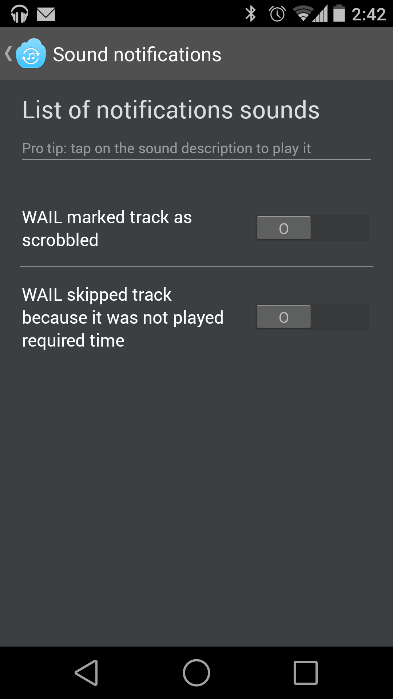

##Android WAIL Beta — nice last.fm scrobbler
**WAIL — What am I listening** 

*Android [last.fm](http://last.fm) scrobbler and "now playing" updater*

*Main* ***develop*** branch build status 

**How it looks:**

&nbsp;

&nbsp;

##Main features:
* Scrobbling tracks to the last.fm (even if you are offline, WAIL will send them later)
* Updating #nowplaying
* Sound notifications

-------------------
###BEFORE CONTRIBUTING TO THE WAIL APP!
Please read small wiki about commits style guides, git work flow and sources styleguides -> [WIKI](https://github.com/artem-zinnatullin/android-wail-app/wiki)  

-------------------
Questions and answers:

* Why repo has small amount of commits? — Because original repo has my personal data, which I decided to remove before making WAIL Open Source. I decided to not use git filter-branch or bfg to delete these files, so I just created new repo with source code. Sorry guys, about ~250 commits losted...
* Why you have last.fm secret api keys in Open Source project? — Just because it's very easy to decompile the apk and get them from it, so, please do not use them for evil purposes :)
* Will WAIL be released to Google Play with your fixes? — YES, of course! This is the main purpose of making WAIL Open Source project, I have no time to work on it, so I hope you will help WAIL!
